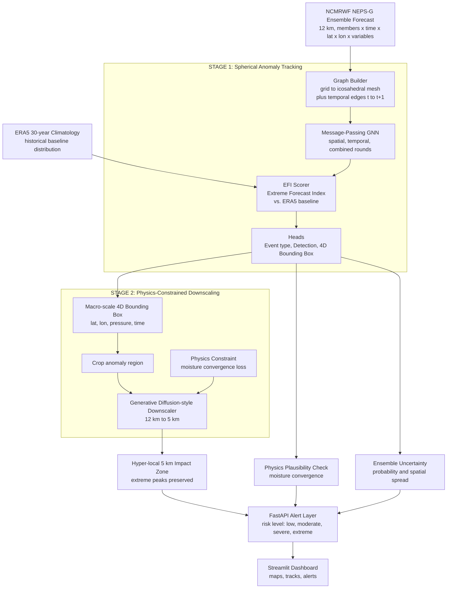

# AI-Driven Spatio-Temporal Tracking of Extreme Weather Anomalies in Medium-Range Forecasts

> An automated two-stage AI pipeline that **finds**, **tracks** and **zooms into** dangerous weather (cyclones, heat domes, cold waves, extreme rainfall) inside huge global ensemble forecasts, then turns the result into risk-graded alerts.

---

## Project Information

- **Problem Statement ID:** 26078
- **Problem Statement:** AI-Driven Spatio-Temporal Tracking of Extreme Weather Anomalies in Medium-Range Forecasts
- **Category:** Software · **Theme:** Weather / Disaster Management
- **Event:** Smart India Hackathon 2026
- **Institution:** Jorhat Engineering College
- **Team name:** VisionX

### Team Members

| Name | Role |
|---|---|
| Debanga Raj Munda | Team Leader |
| Bidyut Jyoti Borah | Member |
| Devahuti Phukan | Member |
| Pervez Mohsin Ahmed | Member |
| Mridul Hazarika | Member |
| Shrutidhara Tasa | Member |

---

## Table of Contents

1. [Executive Summary](#1-executive-summary)
2. [The Problem Statement](#2-the-problem-statement)
3. [Our Solution](#3-our-solution)
4. [System Architecture](#4-system-architecture)
5. [In-Depth Methodology](#5-in-depth-methodology)
6. [How This Solves the Problem](#6-how-this-solves-the-problem)
7. [Scenarios and Evaluation](#7-scenarios-and-evaluation)
8. [Screenshots](#8-screenshots)
9. [Tech Stack](#9-tech-stack)
10. [Repository Structure](#10-repository-structure)
11. [Installation and Quickstart](#11-installation-and-quickstart)
12. [REST Alert API](#12-rest-alert-api)
13. [Prototype Scope and Honest Limitations](#13-prototype-scope-and-honest-limitations)
14. [Roadmap to Real Data](#14-roadmap-to-real-data)

---

## 1. Executive Summary

Extreme weather such as tropical cyclones, heatwaves, cold surges and cloudbursts causes heavy loss of life and property. Modern Numerical Weather Prediction (NWP) systems run dozens of forecast "ensemble members" and produce terabytes of gridded data. Forecasters must then scan this data by hand, under time pressure, to find the dangerous parts.

VisionX proposes an **end-to-end AI pipeline** that:

1. Reads multivariable 4D ensemble forecasts (members × time × lat × lon × variables).
2. Converts them into a **spatio-temporal graph** and uses a **Graph Neural Network (GNN)** to isolate moving anomalies and track them over 3 to 10 days.
3. Scores how unusual each anomaly is using the **Extreme Forecast Index (EFI)** against a long-term climate baseline.
4. Checks the result against **physics** (moisture convergence) so impossible detections are flagged.
5. Measures **ensemble uncertainty** (probability and spatial spread).
6. Passes only the flagged region to a **generative, physics-constrained downscaler** that produces a sharp ~5 km impact zone without flattening the extreme peaks.
7. Serves **risk-graded alerts** through a REST API and an interactive dashboard.

---

## 2. The Problem Statement

### 2.1 In simple words

Weather agencies run a forecast many times with slightly different starting conditions. This bundle is an **Ensemble Prediction System (EPS)**. It is the best way to capture uncertainty, but it produces enormous 4D datasets. The full problem statement is:

> Identifying and tracking the exact geographic footprints of extreme weather anomalies (such as severe cyclones, heat domes, or cold waves) within massive global NWP outputs is computationally intensive and heavily reliant on manual interpretation. In medium-range forecasting (3 to 10 days), atmospheric chaos renders traditional deterministic models highly uncertain. Standard deep learning models (CNNs or U-Nets) suffer from spectral smoothing: they "average out" spatial data, which destroys the extreme amplitudes (the high-intensity peaks of rainfall or wind speed) that forecasters actually need to track. There is a critical gap between coarse 12 km global ensemble datasets and localized, high-fidelity threat tracking.

### 2.2 The core challenges

| # | Challenge | What it means |
|---|---|---|
| 1 | Manual, slow interpretation | Forecasters scan many 2D/3D charts across 10 to 50+ ensemble members by eye. This does not scale. |
| 2 | Atmospheric chaos at 3 to 10 days | Tiny errors in the starting state grow, so storm track, timing and intensity become highly uncertain. |
| 3 | Spectral smoothing | Standard CNNs and U-Nets blur the data and erase the very peaks (strongest wind, heaviest rain) that matter. |
| 4 | Resolution gap | Global ensembles are ~12 km, but disaster response needs local, high-detail (~5 km) impact zones. |
| 5 | No 4D localization | Alerts are usually broad ("heavy rain in District X") or a single 2D point, with no vertical or time boundaries. |

### 2.3 Why traditional approaches fail

| Situation | Traditional approach | Failure mode |
|---|---|---|
| Two storms merge or split | Nearest-centroid (distance) matching | Track identity breaks, continuity falls below 40% in our merging-storm test, phantom paths appear. |
| Several variables matter together | Watching one variable (e.g. rainfall) alone | Misses heatwaves (high temperature, low humidity) and cyclone rotation before rain starts. |
| Local climate context | Fixed absolute thresholds (e.g. above 100 mm) | 50 mm can be catastrophic in an arid region while 100 mm is normal in a rainforest, giving false alarms and misses. |
| Black-box deep learning | Pure data-driven models | Can predict heavy rain where no moisture convergence exists, and smooth away extreme peaks. |

---

## 3. Our Solution

We built a **two-stage hybrid AI architecture**. Think of it as *"spot the storm, then zoom in on it."*

| Stage | Analogy | Technology | Output |
|---|---|---|---|
| **Stage 1: Track** | A radar operator who scans the whole globe and circles anything unusual | GNN on a spherical graph plus EFI | A moving 4D bounding box around each anomaly for the 3 to 10 day window |
| **Stage 2: Downscale** | A photographer zooming into just the circled region without blurring the details | Physics-constrained generative (diffusion-style) downscaler | A sharp ~5 km impact map with peaks preserved |

### 3.1 Core concept

The atmosphere is modelled as a **dynamic spatio-temporal graph**:

- **Nodes** are atmospheric grid cells at a given time, each carrying 11 features (rainfall, wind u and v, temperature, pressure, humidity, normalized lat, lon, elevation, distance to coast, and EFI).
- **Spatial edges** connect neighbouring cells so information about wind flow, moisture and pressure gradients can travel.
- **Temporal edges** connect the same location across consecutive time steps (t to t+1) so the model can follow how a system moves and intensifies.

### 3.2 How it works in plain English

```
[ Raw ensemble forecast ]   10+ members: rain, wind, temperature, pressure, humidity
          |
          v
[ Graph representation ]    weather grid becomes a web of connected points in space and time
          |
          v
[ 3-round GNN ]             nodes share information with neighbours (space) and with
          |                 their past and future selves (time) to spot anomalous patterns
          v
[ EFI scoring ]             "how unusual is this compared with 30 years of climate?"
          |
          v
[ 4D bounding box head ]    draws a tight hazard cube: lat, lon, height, start and end time
          |
          v
[ Physics check ]           does moisture convergence actually support this storm?
          |
          v
[ Ensemble aggregation ]    strike probability and how far the members disagree
          |
          v
[ Downscaling and alerts ]  sharp local impact zone plus a risk-graded alert
```

### 3.3 What the output looks like

Instead of a vague regional warning, responders get a precise statement, for example:

> *"Cyclone threat between 14 N to 18 N and 82 E to 87 E, reaching up to 300 hPa, from T+18 h to T+42 h, high confidence, extreme risk level."*

*(Illustrative wording. Real values come from a pipeline run.)*

---

## 4. System Architecture

### 4.1 High-level view



### 4.2 Layered view (plain-text version)

```
+--------------------------------------------------------------------------+
| 1. DATA LAYER                                                            |
|    NCMRWF NEPS-G (12 km ensemble)  +  ERA5 (30-year climatology)         |
|    Variables: rainfall, wind-u, wind-v, temperature, pressure, humidity  |
+-------------------------------+------------------------------------------+
                                v
+--------------------------------------------------------------------------+
| 2. GRAPH CONSTRUCTION (graph_builder.py)                                 |
|    11-dim feature vector per node, spatial edges + temporal edges        |
+-------------------------------+------------------------------------------+
                                v
+--------------------------------------------------------------------------+
| 3. STAGE 1: SPATIO-TEMPORAL GNN (st_gnn.py)                              |
|    Round 1 spatial -> Round 2 temporal -> Round 3 combined               |
|    Event-type head + Detection head + 4D bounding-box head (bbox_head.py)|
+-------------------------------+------------------------------------------+
                                v
+--------------------------------------------------------------------------+
| 4. PHYSICS AND UNCERTAINTY                                               |
|    Moisture-convergence plausibility (physics_loss.py)                   |
|    Ensemble probability and spatial spread (ensemble_uncertainty.py)     |
+-------------------------------+------------------------------------------+
                                v
+--------------------------------------------------------------------------+
| 5. STAGE 2: DOWNSCALING (downscaler.py)                                  |
|    Crop flagged region -> generative downscaler -> sharp impact zone     |
|    Loss keeps extreme peaks + physics rule                               |
+-------------------------------+------------------------------------------+
                                v
+--------------------------------------------------------------------------+
| 6. RISK AND SERVING LAYER                                                |
|    risk = severity x confidence -> low / moderate / severe / extreme     |
|    FastAPI (api/main.py)  ->  Streamlit dashboard (app.py)               |
+--------------------------------------------------------------------------+
```

### 4.3 Inside the Stage 1 GNN

```
Input tensor (Ensemble, Time, Lat, Lon, 6 channels)
        |
        v  build graph: node = (t, lat, lon)
 Node features (11-dim):
 [rainfall, wind_u, wind_v, temperature, pressure, humidity,
  lat_norm, lon_norm, elevation_norm, coast_dist_norm, EFI]
        |
        v
 Round 1 - SPATIAL   : each node listens to its neighbours     ("what is around me?")
 Round 2 - TEMPORAL  : each node listens to t-1 and t+1        ("how am I changing?")
 Round 3 - COMBINED  : spatial pass on time-aware embeddings   ("put it together")
        |
   +----+-----------------------+
   v    v                       v
 Detection head   Event-type head          4D BBox head
 (is it anomalous?) (cyclone / heatwave /   (lat, lon, pressure,
                     cold wave / extreme     time extents + severity
                     rainfall / normal)      + confidence)
```

---

## 5. In-Depth Methodology

### 5.1 Data representation and graph construction

Each grid cell at $(\text{lat}_i, \text{lon}_j)$ and time $t$ is a node $v_{i,j,t}$ with an **11-dimensional feature vector**:

$$\mathbf{x}_{i,j,t} = \big[\ \text{rain},\ u,\ v,\ T,\ P,\ RH,\ \widehat{\text{lat}},\ \widehat{\text{lon}},\ \widehat{\text{elev}},\ \widehat{d}_{\text{coast}},\ \text{EFI}\ \big]$$

| Group | Features | Notes |
|---|---|---|
| Meteorological (6) | rainfall, zonal wind u, meridional wind v, temperature, pressure, humidity | Core forecast variables |
| Static geography (4) | normalized latitude, longitude, elevation, distance to coast | Terrain and coastline matter for rainfall and cyclones |
| Climatology (1) | Extreme Forecast Index | Tells the network how rare each value is |

**Edges**

- **Spatial edges** connect each cell to its neighbours at the same time step. The target design uses an **icosahedral mesh** so the sphere has no polar distortion; the prototype uses a 4-connected lat/lon grid as a stand-in with the same interface.
- **Temporal edges** connect $(i,j,t) \rightarrow (i,j,t+1)$ to carry motion and intensification forward.

### 5.2 Three-round message-passing GNN

1. **Round 1, spatial aggregation (local balance).** Each node averages information from its spatial neighbours and combines it with its own features. This captures local wind circulation, pressure depressions and moisture build-up.

   $$\mathbf{h}_v^{(1)} = \text{MLP}_{\text{spatial}}\big([\mathbf{x}_v \,\|\, \text{mean}_{u \in \mathcal{N}_s(v)} \mathbf{x}_u]\big)$$

2. **Round 2, temporal aggregation (motion and trend).** Each node averages its own embedding at the previous and next time step. This captures storm movement direction and intensification rate.

   $$\mathbf{h}_v^{(2)} = \text{MLP}_{\text{temporal}}\big([\mathbf{h}_v^{(1)} \,\|\, \tfrac{1}{2}(\mathbf{h}_{v,t-1}^{(1)} + \mathbf{h}_{v,t+1}^{(1)})]\big)$$

3. **Round 3, combined update (holistic context).** A final spatial pass over the time-aware embeddings, with a residual connection and layer normalization.

   $$\mathbf{h}_v^{(3)} = \text{LayerNorm}\big(\mathbf{h}_v^{(2)} + \text{MLP}_{\text{combined}}([\mathbf{h}_v^{(2)} \,\|\, \text{mean}_{u \in \mathcal{N}_s(v)} \mathbf{h}_u^{(2)}])\big)$$

### 5.3 Event typing and the 4D bounding box

From the final embeddings, the network produces:

- **Event-type head:** softmax over `cyclone`, `heatwave`, `cold_wave`, `extreme_rainfall`, `normal`.
- **Detection head:** a per-node anomaly probability.
- **4D bounding-box head:** connected regions of the time-aggregated detection mask become boxes:

$$\mathcal{B} = \big(\,[\text{lat}_{\min}, \text{lat}_{\max}],\ [\text{lon}_{\min}, \text{lon}_{\max}],\ [P_{\text{surface}}, P_{\text{top}}],\ [t_{\text{start}}, t_{\text{end}}]\,\big)$$

Each box also carries **severity** (0 to 1), **confidence** (0 to 1), **probability of exceedance**, **physics plausibility** and a **risk level**.

### 5.4 Extreme Forecast Index (EFI)

Instead of a fixed threshold, EFI compares the forecast ensemble distribution $F(p)$ with the climatological distribution (uniform in probability space, $p$). The standard ECMWF definition is:

$$\text{EFI} = \frac{2}{\pi} \int_0^1 \frac{p - F_f(p)}{\sqrt{p(1-p)}}\, dp \ \in [-1, +1]$$

where $F_f(p)$ is the fraction of ensemble members below the $p$-th climatological quantile.

| EFI value | Meaning |
|---|---|
| near 0 | Forecast matches normal climate |
| above +0.5 | An abnormal extreme is forecast (our alert trigger) |
| near +1 | Almost every member is beyond what the climate record normally shows |

**In this prototype** EFI is computed with a closed-form Mann-Whitney-style approximation, $\text{EFI} \approx \frac{2}{\pi}\arcsin\!\big(\frac{F_{fc}-F_{clim}}{\sqrt{F_{fc}(1-F_{fc})+F_{clim}(1-F_{clim})+\epsilon}}\big)$, against synthetic climatology. The target design computes the full integral against a 30-year ERA5 baseline.

### 5.5 Physics-informed constraint

Pure machine learning can predict heavy rain where the atmosphere cannot support it. We add a **moisture convergence** rule:

$$\text{Moisture convergence} = -\nabla \cdot (q\,\vec{v}) = -\Big(\frac{\partial (qu)}{\partial x} + \frac{\partial (qv)}{\partial y}\Big)$$

Extreme rainfall should occur where moisture is being drawn together (convergence is positive). The module provides:

- a **loss term** used when training the downscaler, and
- an inference-time **plausibility score** in $[0,1]$ that lowers the confidence of physically implausible detections.

### 5.6 Ensemble uncertainty

The tracker runs across all ensemble members and matches tracks between them. It reports:

- **Event probability:** fraction of members that show the threat.
- **Spatial spread:** how far the predicted centre differs across members (degrees).
- **Intensity spread:** how much peak intensity differs.
- A qualitative **confidence** label used in the final risk decision.

### 5.7 Downscaling that keeps the peaks

Stage 2 crops only the flagged region and refines it from ~12 km toward a ~5 km impact zone. Standard training with MSE alone produces blur, so the loss is decomposed:

$$\mathcal{L} = \mathcal{L}_{\text{MSE}} + \lambda_1\,\mathcal{L}_{\text{extreme (P90)}} + \lambda_2\,\mathcal{L}_{\text{peak}} + \lambda_3\,\mathcal{L}_{\text{physics}}$$

| Term | Role |
|---|---|
| MSE | General accuracy |
| Extreme (P90) | Extra weight on the top 10% of values |
| Peak | Penalises the model if the maximum is flattened |
| Physics | Discourages rain where moisture convergence is low |

Conditioning on terrain (elevation and coast distance) helps place local detail correctly.

### 5.8 Risk alert rule

$$\text{risk} = f(\text{severity} \times \text{confidence}) \ \rightarrow\ \text{low} \rightarrow \text{moderate} \rightarrow \text{severe} \rightarrow \text{extreme}$$

Severe events with confidence below 0.3 are capped at *moderate* to avoid false alarms.

---

## 6. How This Solves the Problem

| Problem | How we solve it |
|---|---|
| Manual, slow interpretation of massive NWP data | The GNN scans the whole ensemble automatically and outputs ready-made 4D boxes and tracks. |
| Chaotic, uncertain 3 to 10 day forecasts | The full ensemble is used, so the output is a probability and spread, not one fragile guess. |
| Distortion from flat 2D grids | A spherical / icosahedral graph removes polar stretching and respects real geometry. |
| Storm merges and splits break trackers | Nodes share spatial and temporal context, so track identity survives merges. |
| Fixed thresholds ignore local climate | EFI measures rarity against the local historical distribution. |
| Spectral smoothing kills extreme peaks | The generative downscaler with extreme-tail and peak losses keeps high-intensity values sharp. |
| Gap between 12 km global and local threats | Stage 2 produces a ~5 km impact zone, only where needed, which keeps compute low. |
| AI that ignores physics | A moisture-convergence constraint and plausibility score flag impossible outputs. |
| Raw data is hard to act on | Risk levels, a REST API and a dashboard turn output into actionable alerts. |

**Before and after**

| | Traditional workflow | VisionX pipeline |
|---|---|---|
| Finding anomalies | Manual map inspection | Automatic |
| Forecast input | Often a single run | Whole ensemble (probabilistic) |
| Geometry | Flat grid | Spherical graph |
| Extreme values | Smoothed / averaged | Preserved |
| Local detail | Coarse 12 km | ~5 km impact zone |
| Output | Raw grids | Tracks, probabilities, risk alerts |

---

## 7. Scenarios and Evaluation

### 7.1 Built-in test scenarios

| Scenario | What it simulates | Threshold baseline | ST-GNN |
|---|---|---|---|
| **A** | One localized severe storm crossing the domain | Tracks well (about 100% continuity) | Produces a 4D box with high confidence |
| **B** | Two storms approaching and merging | Continuity drops below 40%, identity breaks | Handles the merge through spatial context |
| **cyclone** | Large rotating vortex moving north-west (Bay of Bengal style) | Track breaks at the merge | Deep vertical range and rotating wind classified as cyclone |
| **heatwave** | Land-locked temperature anomaly | Missed by rainfall-only thresholds | Temperature channel lifted by EFI, so it is detected |

### 7.2 Metrics computed by the project

| Area | Metrics |
|---|---|
| Tracking | Mean centroid error, IoU, track continuity |
| 4D bounding boxes | Detection rate, mean bbox IoU, mean centroid error |
| Downscaling | MSE, extreme-value (P90 tail) error, peak-preservation error |
| Probability | Brier score and reliability table (stubs until real hindcast data is used) |

To reproduce a comparison, run `python run_pipeline.py B` and read the printed metrics table. Add your own measured numbers here before the final submission.

### 7.3 Results table (fill with your own run)

| Metric | Baseline detector | ST-GNN |
|---|---|---|
| Track continuity (merging storms) | *run and fill* | *run and fill* |
| Mean centroid error (grid units) | *run and fill* | *run and fill* |
| Mean bbox IoU | *run and fill* | *run and fill* |
| Peak preservation (downscaler) | *bilinear: run and fill* | *learned: run and fill* |

---

## 8. Screenshots


### Dashboard overview


**How to capture them:** run `python -m streamlit run app.py`, pick a scenario in the sidebar, and screenshot each panel (Windows: `Win + Shift + S`). For the API screenshot, run `uvicorn api.main:app --port 8000` and open `/docs`.

---

## 9. Tech Stack

| Layer | Technology | Purpose |
|---|---|---|
| Language | **Python** (3.10 or newer) | Whole pipeline |
| Deep learning | **PyTorch** | Spatio-temporal GNN, downscaler |
| Graph modelling | Custom message-passing layers (icosahedral mesh design, GraphCast / GraphWeather style) | Spherical anomaly tracking |
| Generative model | Diffusion-inspired conditional downscaler (UNet backbone) | 12 km to 5 km statistical downscaling |
| Scientific computing | **NumPy, SciPy** | EFI, climatology, connected components, finite-difference physics terms |
| Data formats (target) | **xarray, cfgrib, NetCDF / GRIB2** | Reading NCMRWF NEPS-G and ERA5 |
| Backend | **FastAPI, Uvicorn, Pydantic** | REST alert service and request validation |
| Storage | **SQLite** (prototype), PostgreSQL / PostGIS (planned) | Event cache |
| Frontend | **Streamlit, Matplotlib** | Interactive dashboard |
| Testing | **pytest** | Data generator and pipeline replay tests |
| Tooling | **pip / uv**, virtual environments | Reproducible setup |

**Data sources**

| Source | Role |
|---|---|
| NCMRWF NEPS-G (12 km global ensemble) | Forecast input |
| ERA5 (30-year reanalysis) | Climatological baseline for EFI |

---

## 10. Repository Structure

```
sih_weather_prototype/
├── README.md                        # Project documentation
├── DEMO_GUIDE.md                    # 5-minute demo script
├── run_pipeline.py                  # CLI runner (ST-GNN plus baseline)
├── app.py                           # Streamlit dashboard
├── gnn_tracker.pth                  # Saved weights for the baseline GNN tracker
│
├── api/
│   ├── __init__.py
│   ├── main.py                      # FastAPI alert server
│   └── README.md                    # curl examples
│
├── src/
│   ├── data/
│   │   ├── synthetic_generator.py   # Synthetic 6-channel ensemble weather generator
│   │   ├── climatology.py           # Climatology baseline
│   │   └── efi.py                   # Extreme Forecast Index scorer
│   ├── models/
│   │   ├── st_gnn.py                # Spatio-temporal GNN (3-round message passing)
│   │   ├── graph_builder.py         # Spatial and temporal graph construction
│   │   ├── bbox_head.py             # 4D bounding-box head and schema
│   │   ├── downscaler.py            # Conditional downscaler plus bilinear baseline
│   │   ├── physics_loss.py          # Moisture-convergence constraint and plausibility
│   │   ├── ensemble_uncertainty.py  # Probability and spatial spread
│   │   ├── baseline_detector.py     # Threshold detector (comparator)
│   │   ├── tracker.py               # Tracking state, 4D schema, Euclidean tracker
│   │   ├── gnn_tracker.py           # Earlier single-hop GNN tracker (comparator)
│   │   └── train_gnn.py             # Training loop
│   └── evaluation/
│       └── metrics.py               # IoU, centroid error, continuity
│
├── tests/
│   ├── test_data_generator.py       # Synthetic data tests
│   └── test_pipeline_replay.py      # End-to-end pipeline tests
│
└── docs/screenshots/                # Images used in this README
```

---

## 11. Installation and Quickstart

### 11.1 Setup

```bash
# Clone the repository
git clone <your-repo-url>
cd sih_weather_prototype

# Create and activate a virtual environment
python -m venv venv
source venv/bin/activate          # Windows: venv\Scripts\activate

# Install dependencies
pip install torch numpy scipy matplotlib streamlit fastapi uvicorn pydantic requests pytest
```

### 11.2 Run the dashboard

```bash
python -m streamlit run app.py
```
Open `http://localhost:8501` to explore 4D boxes, ensemble uncertainty, EFI heatmaps and downscaling comparisons.

### 11.3 Run the pipeline from the command line

```bash
python run_pipeline.py              # scenarios A and B
python run_pipeline.py cyclone      # cyclone scenario
python run_pipeline.py heatwave     # heatwave scenario
```

### 11.4 Run the alert API

```bash
uvicorn api.main:app --reload --port 8000
```
- Interactive docs: `http://localhost:8000/docs`
- Health check: `curl http://localhost:8000/health`
- Trigger a run:
  ```bash
  curl -X POST http://localhost:8000/forecast/run \
       -H "Content-Type: application/json" \
       -d '{"scenario": "cyclone", "ensemble_members": 10}'
  ```

### 11.5 Run the tests

```bash
python -m pytest tests/ -v
```

---

## 12. REST Alert API

| Method | Endpoint | Description |
|---|---|---|
| GET | `/health` | Service status |
| POST | `/forecast/run` | Start a pipeline run: `{"scenario": "cyclone", "ensemble_members": 10}` |
| GET | `/forecast/run/{run_id}` | Check the status of a run |
| GET | `/events` | List detected events (optional `?scenario=cyclone`) |
| GET | `/events/{id}` | Full metadata and 4D bounding box for one event |
| GET | `/events/{id}/track` | Trajectory over the forecast window |
| GET | `/events/{id}/impact-grid` | Downscaled impact zone |
| GET | `/events/{id}/alerts` | Risk-level alert with recommended action |

Valid scenarios: `A`, `B`, `cyclone`, `heatwave`.

**Risk levels and recommended actions**

| Risk level | Colour | Recommended action |
|---|---|---|
| low | green | Monitor, no immediate action |
| moderate | amber | Advisory issued, prepare response teams |
| severe | orange-red | Warning issued, activate district-level response |
| extreme | dark red | Emergency alert, activate full disaster response protocol |

**Example response from `GET /events/{id}/alerts`** (illustrative values)

```json
{
  "event_id": "ev_cyclone_001",
  "event_type": "cyclone",
  "risk_level": "extreme",
  "colour": "#B71C1C",
  "recommended_action": "EMERGENCY ALERT - activate full disaster response protocol.",
  "severity": 0.94,
  "confidence": 0.91,
  "physics_plausibility": 0.98,
  "probability_exceedance": 0.89
}
```

**Example 4D bounding-box fields from `GET /events/{id}`** (illustrative values)

```json
{
  "event_type": "cyclone",
  "forecast_time": 18,
  "latitude_range": [14.2, 19.8],
  "longitude_range": [82.5, 88.1],
  "vertical_range": [850.0, 1013.0],
  "start_time": 18,
  "end_time": 42,
  "severity": 0.94,
  "confidence": 0.91,
  "probability_exceedance": 0.89,
  "physics_plausibility": 0.98,
  "risk_level": "extreme",
  "speed": 1.2,
  "direction_deg": 315.0
}
```

---

## 13. Prototype Scope and Honest Limitations

This repository is a **working software prototype** built to validate the architecture end to end without needing terabytes of data on a student laptop.

**Implemented and working**
- Multi-variable (6-channel) ensemble tensor pipeline with four scripted scenarios
- Spatio-temporal graph with spatial and temporal edges
- 3-round message-passing GNN with event-type, detection and 4D bounding-box heads
- EFI scoring (closed-form approximation)
- Downscaler with extreme-tail and peak-preservation losses, plus a bilinear baseline
- Moisture-convergence physics constraint and plausibility score
- Ensemble uncertainty (probability and spatial spread)
- Risk-level mapper, FastAPI alert layer, Streamlit dashboard, tests

**Simulated or simplified in this prototype**

| Item | Prototype | Target design |
|---|---|---|
| Weather data | Synthetic generator | Real NCMRWF NEPS-G plus ERA5 |
| Spatial graph | 4-connected lat/lon grid (stand-in) | Icosahedral mesh |
| EFI | Closed-form approximation, synthetic climatology | Full integral over 30-year ERA5 baseline |
| Downscaler | UNet-lite with diffusion-inspired loss | Full conditional diffusion model (DDPM / EDM) |
| GNN training | Not trained on real labelled events (weights are not pre-trained on real data) | Supervised on labelled real event tracks |
| Vertical extent | Proxy by event type | Real pressure-level fields |
| Physics terms | Finite differences on a flat grid | Spherical operators, pressure levels |
| Probability calibration | Stub | Reliability and ECE on hindcast archive |
| Database | In-memory SQLite (lost on restart) | PostgreSQL / PostGIS |

Because the data loader is isolated behind a fixed tensor interface `(E, T, H, W, 6)`, moving to real data mainly means replacing the loader, mesh and climatology, not rewriting the GNN heads or the API.

---

## 14. Roadmap to Real Data

| Subsystem | Prototype component | Planned replacement |
|---|---|---|
| Data ingestion | `SyntheticDataLoader` | `RealWeatherDataLoader` reading NCMRWF NEPS-G NetCDF / GRIB2 with `xarray` and `cfgrib` |
| Spatial mesh | 4-connected grid in `graph_builder.py` | Icosahedral multi-mesh (GraphCast / GraphWeather style) |
| Climatology | Synthetic distributions | 30-year ERA5 percentile / CDF arrays for EFI |
| Topography | Procedural elevation and coast distance | SRTM global DEM plus a global shoreline dataset |
| GNN training | Synthetic tasks | Supervised training on ERA5 with labelled tracks (IBTrACS for cyclones, heatwave indices) |
| Downscaler training | Synthetic pairs | Paired 12 km to high-resolution data (radar and station interpolation) |
| Calibration | Stub | Reliability and ECE on the reforecast archive |
| Storage | In-memory SQLite | PostgreSQL / PostGIS |
| Deployment | Local run | Containerised deployment with alert integration |

---

## Team VisionX · Jorhat Engineering College

Built for **Smart India Hackathon 2026** · Problem Statement **26078**

Debanga Raj Munda (Team Leader) · Bidyut Jyoti Borah · Devahuti Phukan · Pervez Mohsin Ahmed · Mridul Hazarika · Shrutidhara Tasa
